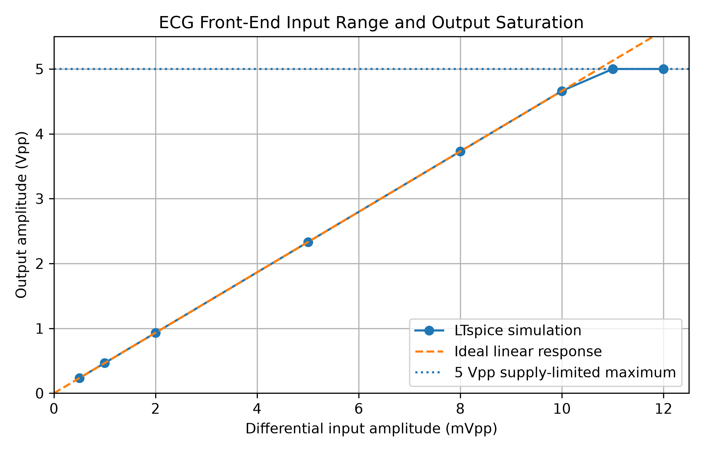

# ECG Analog Front-End Design & Simulation

A simulated analog front-end (AFE) for ECG signal acquisition, developed in LTspice and supported by Python-based analysis.

The project focuses on the analog conditioning stages that precede digital ECG processing: differential amplification, common-mode rejection, band-limiting, output gain, resistor-tolerance analysis, and output headroom.

This project complements my digital ECG signal-processing project:

https://github.com/vhancajimal/ecg-signal-processing

---

## Project Overview

ECG signals have very small differential amplitudes and are commonly affected by large common-mode components and low-frequency baseline variations. An analog front-end therefore needs to amplify the differential signal while rejecting common-mode interference and restricting the signal bandwidth before digitization.

The simulated signal chain implemented in this project is:

```text
Differential ECG input
        |
        v
3-op-amp Instrumentation Amplifier
        |
        v
High-pass filter
        |
        v
Low-pass filter
        |
        v
Post-gain stage
        |
        v
Conditioned analog output
```

The current design uses a 0–5 V single supply and a 2.5 V reference voltage so that the ECG waveform can be centered within the available output range.

---

## Main Design Targets

| Parameter | Design target / value |
|---|---:|
| Supply voltage | 0–5 V |
| Reference voltage | 2.5 V |
| Differential test signal | 1 mVpp at 10 Hz |
| Instrumentation-amplifier gain | ~5 V/V |
| High-pass cutoff | ~0.5 Hz |
| Low-pass cutoff | ~40 Hz |
| Post-gain stage | 100 V/V |
| Nominal amplifier gain | 500 V/V |
| Simulated overall gain at 10 Hz | ~466 V/V |
| Common-mode test frequency | 50 Hz |
| Common-mode test amplitude | 200 mVpp |

The nominal amplifier gain is approximately 500 V/V from the two active gain stages alone. Because the passive filters introduce some attenuation, the complete simulated front-end produces an overall gain of approximately 466 V/V at 10 Hz.

---

## 1. Instrumentation Amplifier

The input stage is a three-op-amp instrumentation-amplifier topology.

### First stage

The first two op-amps use:

- R1 = 10 kΩ
- R3 = 10 kΩ
- Rg = 5 kΩ

The theoretical differential gain is:

```text
G = 1 + 2R/Rg
```

Therefore:

```text
G = 1 + 2(10 kΩ)/(5 kΩ)
  = 5
```

### Difference amplifier

The third op-amp uses four matched 20 kΩ resistors and performs unity-gain subtraction.

The output is referenced to 2.5 V rather than ground so that the circuit can operate from a single 0–5 V supply.

For a 1 mVpp differential input, the instrumentation amplifier produces approximately 5 mVpp at its output.

---

## 2. Common-Mode Rejection Analysis

To evaluate common-mode rejection, a 50 Hz common-mode signal was applied simultaneously to both inputs.

The test common-mode signal was:

```text
VCM = 2.5 V + 0.1*sin(2*pi*50*t)
```

This corresponds to:

```text
200 mVpp common-mode interference
```

With perfectly matched resistors in the difference amplifier, the common-mode component is strongly rejected.

To investigate resistor-tolerance sensitivity, one 20 kΩ resistor in the subtraction stage was varied according to:

```text
R = 20 kΩ * (1 + mismatch)
```

The simulated mismatch values were:

```text
0.1 %
0.5 %
1.0 %
2.0 %
```

### Differential gain

The differential gain was also measured for each mismatch value.

| Resistor mismatch | Differential gain Ad |
|---:|---:|
| 0.1 % | 5.0019 |
| 0.5 % | 5.0167 |
| 1.0 % | 5.0355 |
| 2.0 % | 5.0727 |

### Common-mode gain and CMRR

The common-mode gain was calculated from:

```text
Acm = Vout_CM_pp / Vin_CM_pp
```

and CMRR from:

```text
CMRR = 20*log10(Ad/Acm)
```

The resulting values were:

| Resistor mismatch | Common-mode gain Acm | CMRR |
|---:|---:|---:|
| 0.1 % | 0.000502 | ~80.0 dB |
| 0.5 % | 0.002501 | ~66.0 dB |
| 1.0 % | 0.005001 | ~60.1 dB |
| 2.0 % | 0.010002 | ~54.1 dB |

The results show the strong dependence of CMRR on resistor matching. Even relatively small mismatch in the subtraction stage significantly increases common-mode gain.

### CMRR result


### Common-mode gain result


---

## 3. High-Pass Filter

A passive high-pass stage was added after the instrumentation amplifier.

Component values:

```text
C1 = 2.2 uF
R8 = 150 kΩ
```

Because the circuit uses a single supply, the resistor is connected to VREF = 2.5 V rather than directly to ground.

The theoretical cutoff frequency is:

```text
fc = 1 / (2*pi*R*C)
```

which gives:

```text
fc ≈ 0.482 Hz
```

The LTspice AC-analysis measurement produced:

```text
HP_FC = 0.4823447 Hz
```

This closely matches the theoretical value.

---

## 4. Low-Pass Filter and Complete Band-Pass Response

The low-pass stage uses:

```text
R9 = 39 kΩ
C2 = 100 nF
```

Its isolated theoretical cutoff is approximately:

```text
fc ≈ 40.8 Hz
```

The high-pass and low-pass stages are cascaded without an active buffer between them. Because passive stages load each other, the complete band-pass response does not exactly equal the cutoff frequencies calculated for each stage independently.

AC analysis of the complete passive filter network produced:

| Parameter | Simulated value |
|---|---:|
| Peak magnitude | -0.484 dB |
| Peak-response frequency | 4.47 Hz |
| Lower cutoff frequency | 0.452 Hz |
| Upper cutoff frequency | 43.57 Hz |

The -3 dB cutoff frequencies were determined relative to the actual pass-band peak rather than to an absolute 0 dB level.

This demonstrates the loading interaction between cascaded passive RC stages.

---

## 5. Post-Gain Stage

After band-limiting, a non-inverting amplifier provides the final gain.

Component values:

```text
R10 = 1 kΩ
R11 = 99 kΩ
```

The gain is:

```text
Gpost = 1 + R11/R10
      = 1 + 99 kΩ / 1 kΩ
      = 100
```

The non-inverting input receives the filtered ECG signal.

The feedback network is referenced to VREF = 2.5 V, giving:

```text
Vafe_out = VREF + 100 * (Vlp_out - VREF)
```

This preserves the 2.5 V DC operating point while amplifying the ECG component around it.

---

## 6. Complete Front-End Gain

For a 1 mVpp differential input at 10 Hz, the complete front-end produces approximately:

```text
Vout ≈ 0.466 Vpp
```

Therefore:

```text
Atotal ≈ 0.466 Vpp / 0.001 Vpp
       ≈ 466 V/V
```

This is slightly below the nominal active-stage gain of:

```text
5 * 100 = 500 V/V
```

because the passive filter network attenuates the 10 Hz signal slightly.

---

## 7. Input Range and Output Headroom

The complete ECG analog front-end was tested with different differential input amplitudes to evaluate its output headroom and identify the onset of saturation.

The test input was a 10 Hz differential sinusoid.

Measured results:

| Differential input | Output maximum | Output minimum | Output amplitude |
|---:|---:|---:|---:|
| 0.5 mVpp | 2.617 V | 2.384 V | 0.233 Vpp |
| 1.0 mVpp | 2.734 V | 2.268 V | 0.466 Vpp |
| 2.0 mVpp | 2.969 V | 2.037 V | 0.932 Vpp |
| 5.0 mVpp | 3.673 V | 1.342 V | 2.331 Vpp |
| 8.0 mVpp | 4.376 V | 0.647 V | 3.729 Vpp |
| 10.0 mVpp | 4.845 V | 0.184 V | 4.661 Vpp |
| 11.0 mVpp | 5.000 V | 0.0005 V | 4.999 Vpp |
| 12.0 mVpp | 5.000 V | 0.0003 V | 4.999 Vpp |

Within the linear operating region, the gain remains approximately:

```text
Atotal ≈ 466 V/V
```

For an ideal 0–5 V output range, the maximum differential input before the output reaches the supply rails can be estimated as:

```text
Vin,max ≈ 5 Vpp / 466
        ≈ 10.7 mVpp
```

The LTspice simulation agrees with this estimate:

- 10 mVpp remains approximately linear.
- At 11 mVpp, the output reaches the supply rails and clipping begins.
- Increasing the input to 12 mVpp no longer produces a proportional increase in output amplitude.

This establishes an approximate simulated linear differential input range of up to 10 mVpp for the current configuration.



---

## 8. LTspice Measurements

Representative LTspice measurements used in the project include:

### Common-mode rejection

```spice
.meas tran VinCMpp PP V(VCM) FROM 0.2 TO 1
.meas tran VoutCMpp PP V(out) FROM 0.2 TO 1
.meas tran Acm PARAM VoutCMpp/VinCMpp
```

### Differential gain

```spice
.meas tran VinDiffPP PP V(in_plus,in_minus) FROM 0.2 TO 1
.meas tran VoutDiffPP PP V(out) FROM 0.2 TO 1
.meas tran Ad PARAM VoutDiffPP/VinDiffPP
```

### High-pass cutoff

```spice
.meas ac HP_FC WHEN mag(V(hp_out)/V(hp_in))=0.70710678 CROSS=1
```

### Complete band-pass response

```spice
.meas ac BP_MAX MAX mag(V(lp_out)/V(bp_in))
.meas ac BP_FPEAK WHEN mag(V(lp_out)/V(bp_in))=BP_MAX
.meas ac BP_FL WHEN mag(V(lp_out)/V(bp_in))=0.669 CROSS=1
.meas ac BP_FH WHEN mag(V(lp_out)/V(bp_in))=0.669 CROSS=2
```

### Output headroom

```spice
.meas tran VoutMax MAX V(afe_out) FROM 0.5 TO 1
.meas tran VoutMin MIN V(afe_out) FROM 0.5 TO 1
.meas tran VoutPP PP V(afe_out) FROM 0.5 TO 1
```

---

## 9. Python Analysis

Python is used to process and visualize selected LTspice results.

The current analysis includes:

- CMRR versus resistor mismatch
- Common-mode gain versus resistor mismatch
- Input amplitude versus final output amplitude
- Visualization of the onset of output saturation

The scripts use:

- NumPy
- Matplotlib

---

## Repository Structure

```text
ecg-analog-front-end/
├── docs/
│   └── design_requirements.md
│
├── ltspice/
│   ├── ina_common_mode_ideal.asc
│   ├── ina_common_mode_mismatch_1pct.asc
│   ├── ina_common_mode_mismatch_sweep.asc
│   ├── ina_differential_gain_sweep.asc
│   ├── ecg_front_end_highpass.asc
│   ├── ecg_front_end_highpass_ac.asc
│   ├── ecg_front_end_bandpass.asc
│   ├── ecg_front_end_bandpass_ac.asc
│   ├── ecg_front_end_complete.asc
│   └── ecg_front_end_headroom_sweep.asc
│
├── python/
│   ├── plot_cmrr_results.py
│   └── plot_headroom_results.py
│
├── results/
│   ├── cmrr_vs_resistor_mismatch.png
│   ├── common_mode_gain_vs_resistor_mismatch.png
│   └── headroom_saturation.png
│
└── README.md
```

File names may vary slightly as the project develops.

---

## Key Results

The main findings of the current simulation are:

- The instrumentation-amplifier stage provides a differential gain of approximately 5 V/V.
- The high-pass stage has a simulated cutoff of approximately 0.482 Hz.
- The complete passive band-pass network has simulated cutoff frequencies of approximately 0.452 Hz and 43.57 Hz.
- Resistor mismatch in the difference amplifier strongly affects common-mode rejection.
- CMRR decreases from approximately 80 dB at 0.1 % mismatch to approximately 54 dB at 2 % mismatch.
- The complete front-end provides approximately 466 V/V gain at 10 Hz.
- The circuit remains approximately linear up to a 10 mVpp differential input.
- Output clipping begins between 10 and 11 mVpp for the current 0–5 V supply configuration.

---

## Tools

- LTspice
- Python
- NumPy
- Matplotlib
- Visual Studio Code
- Git / GitHub

---

## Current Limitations

The current design is intended as an engineering simulation and learning project rather than a clinically validated ECG acquisition system.

Important limitations include:

- The current simulations use LTspice's `UniversalOpamp2` model.
- Real op-amp input/output swing limitations, input bias current, offset voltage, noise, and finite CMRR are not yet fully represented.
- Electrode impedance and electrode imbalance are not yet modeled.
- No driven-right-leg circuit is currently included.
- The passive high-pass and low-pass stages interact because they are cascaded without buffering.
- Power-supply noise and detailed PCB/layout effects are not modeled.
- The circuit has not yet been built or validated with physical hardware.
- The design is not intended for diagnostic or clinical use.

---

## Planned Improvements

The next development steps are:

1. Replace `UniversalOpamp2` with a realistic op-amp model suitable for 5 V single-supply operation.
2. Re-evaluate gain, output swing, bandwidth, and saturation using the real device model.
3. Investigate practical non-idealities such as input offset, noise, and bias currents.
4. Test the complete front-end with an ECG-like waveform rather than only sinusoidal test signals.
5. Compare the conditioned analog output with the digital ECG-processing pipeline.

These additions will connect the analog acquisition stage more directly to a realistic biomedical signal-processing workflow.

---

## Related Project

A complementary digital ECG-processing project is available here:

https://github.com/vhancajimal/ecg-signal-processing

That project includes:

- MIT-BIH ECG data
- band-pass filtering
- R-peak detection
- RR-interval estimation
- heart-rate estimation
- validation against reference annotations

Together, the two projects represent a simplified ECG signal chain:

```text
Electrodes
   |
   v
Analog front-end
   |
   v
Conditioned analog ECG
   |
   v
ADC / sampled ECG
   |
   v
Digital filtering and R-peak detection
   |
   v
Heart-rate analysis
```

---

## Author

Victor Hugo Ancajima Lozano  
B.Sc. Biomedical Engineering  
TU Ilmenau

GitHub: https://github.com/vhancajimal

---

## Disclaimer

This project is intended for educational and engineering-development purposes only. It is not a medical device and must not be used for diagnosis, patient monitoring, or clinical decision-making.
