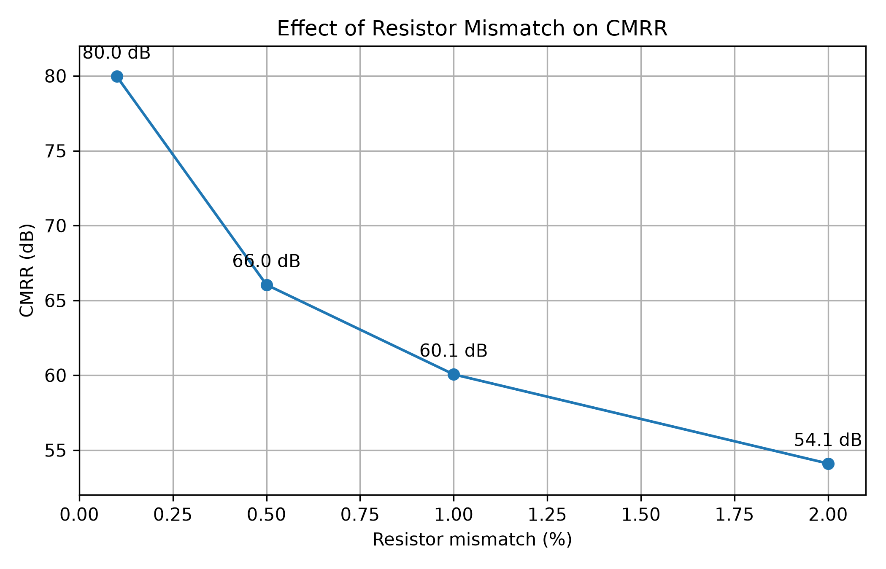
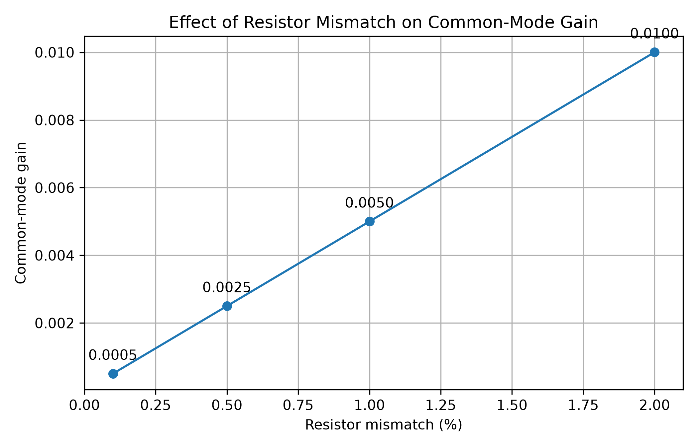

# ECG Analog Front-End Design and CMRR Analysis

Design and simulation of a three-op-amp instrumentation amplifier for ECG signal acquisition, with emphasis on differential amplification, common-mode interference rejection, and the effect of resistor mismatch on CMRR.

The project combines analog biomedical instrumentation, LTspice simulation, and Python-based analysis of simulation results.

> This project is intended for educational and simulation purposes only. It is not a clinically validated medical device.

---

## Overview

ECG signals have amplitudes in the millivolt range and can be significantly affected by common-mode interference, including power-line interference.

An analog front-end therefore needs to:

- provide high input impedance,
- amplify small differential signals,
- reject common-mode signals,
- preserve the useful ECG signal,
- and avoid excessive sensitivity to component tolerances.

This project investigates a three-op-amp instrumentation amplifier and, in particular, how resistor mismatch in its differential stage affects common-mode rejection.

---

## Design Objectives

The initial design requirements were:

| Parameter | Target |
|---|---:|
| Nominal ECG differential signal | 1 mVpp |
| ECG test range | 0.5–5 mVpp |
| First-stage differential gain | ~5 V/V |
| Supply voltage | 5 V |
| Output reference voltage | 2.5 V |
| Common-mode interference | 50 Hz |
| Common-mode amplitude used for testing | 100 mV peak |
| Initial CMRR target | > 80 dB |

The relatively low gain in the first stage was selected to preserve headroom before further filtering and amplification stages are added.

---

## Instrumentation Amplifier

A classical three-op-amp instrumentation amplifier topology was used.

The first two op-amps provide high input impedance and differential gain.

For:

- R = 10 kΩ
- Rg = 5 kΩ

the theoretical first-stage gain is:

G = 1 + 2R / Rg

which gives:

G = 1 + 2(10 kΩ) / 5 kΩ
G = 5

The third op-amp operates as a differential amplifier referenced to 2.5 V.

With perfectly matched 20 kΩ resistors in the differential stage, the circuit ideally rejects signals that are present equally at both inputs.

---

## Differential-Gain Verification

Before introducing common-mode interference, the amplifier was tested with a controlled differential sinusoidal signal:

Differential input:
1 mVpp at 10 Hz

The two input signals were centered around 2.5 V and driven with opposite differential components.

The simulated output was approximately:

Input differential signal ≈ 1 mVpp
Output differential signal ≈ 5 mVpp

corresponding to a differential gain of approximately:

|Ad| ≈ 5

The output polarity is inverted relative to the defined input differential polarity because of the connection order of the final differential stage.

---

## Common-Mode Interference Test

A 50 Hz common-mode signal was then introduced:

VCM = 2.5 V + 0.1 sin(2π·50t)

while maintaining the 1 mVpp differential signal at 10 Hz.

The resulting inputs can be represented as:

Vin+ = VCM + Vdiff/2
Vin- = VCM - Vdiff/2

Although each individual input contains approximately 200 mVpp of 50 Hz common-mode interference, subtraction of the two inputs removes the common-mode component in the ideal matched-resistor case.

The amplifier therefore continues to reproduce the differential ECG-like signal while rejecting the common-mode interference.

---

## Resistor-Mismatch Experiment

The differential amplifier initially used four matched 20 kΩ resistors.

To investigate the effect of resistor tolerances, one resistor was modified according to:

R5 = 20 kΩ × (1 + mismatch)

The following mismatch values were simulated:

0.1 %
0.5 %
1.0 %
2.0 %

A parametric sweep was performed in LTspice.

For each mismatch value, both differential gain and common-mode gain were measured independently.

---

## CMRR Calculation

The common-mode rejection ratio was calculated using measured simulation values:

CMRR = 20 log10(|Ad / Acm|)

where:

- Ad = measured differential gain
- Acm = measured common-mode gain

This avoids assuming that the differential gain remains exactly constant when resistor mismatch is introduced.

---

## Results

| Resistor mismatch (%) | Differential gain Ad | Common-mode gain Acm | CMRR (dB) |
|---:|---:|---:|---:|
| 0.1 | 5.0019 | 0.0005019 | 79.97 |
| 0.5 | 5.0167 | 0.0025010 | 66.05 |
| 1.0 | 5.0355 | 0.0050008 | 60.06 |
| 2.0 | 5.0727 | 0.0100017 | 54.10 |

### CMRR versus resistor mismatch



The results show a strong degradation in common-mode rejection as resistor mismatch increases.

Increasing mismatch from 0.1% to 2% reduces the simulated CMRR from approximately 80 dB to 54 dB.

This illustrates the importance of resistor-ratio matching in the differential stage of an instrumentation amplifier.

### Common-mode gain versus resistor mismatch



The common-mode gain increases approximately linearly with resistor mismatch.

As the resistor ratios become increasingly unequal, a larger fraction of the 50 Hz common-mode interference is converted into an output signal.

---

## Key Findings

- The three-op-amp instrumentation amplifier achieved the expected differential gain of approximately 5 V/V.
- A large 50 Hz common-mode signal was strongly rejected when the differential-stage resistor ratios were perfectly matched.
- Resistor mismatch caused measurable 50 Hz common-mode leakage at the output.
- A 1% mismatch resulted in a common-mode gain of approximately 0.005 and a CMRR of approximately 60 dB.
- Reducing mismatch to 0.1% improved the simulated CMRR to approximately 80 dB.
- Accurate resistor-ratio matching is therefore an important design consideration for biomedical differential amplifiers.

---

## Simulation and Analysis Tools

- LTspice
- Python
- NumPy
- Matplotlib
- Git / GitHub

---

## Repository Structure

```text
ecg-analog-front-end/
│
├── docs/
│   └── design_requirements.md
│
├── ltspice/
│   ├── ina_common_mode_ideal.asc
│   ├── ina_common_mode_mismatch_1pct.asc
│   ├── ina_common_mode_mismatch_sweep.asc
│   └── ina_differential_gain_sweep.asc
│
├── python/
│   └── plot_cmrr_results.py
│
├── results/
│   ├── cmrr_vs_resistor_mismatch.png
│   └── common_mode_gain_vs_resistor_mismatch.png
│
└── README.md
```

---

## Current Limitations

The current simulations use LTspice's UniversalOpamp2 model and therefore do not yet represent all non-ideal characteristics of a specific real operational amplifier.

The current analysis focuses primarily on differential gain, common-mode interference, and resistor mismatch.

Effects such as the following have not yet been fully evaluated:

- input-referred noise,
- input offset voltage,
- input bias currents,
- finite op-amp CMRR,
- finite gain-bandwidth product,
- electrode impedance imbalance,
- output swing limitations,
- component tolerances across the complete analog front-end.

---

## Future Work

Planned extensions include:

- high-pass filtering for baseline-drift reduction,
- low-pass filtering for bandwidth limitation,
- additional gain stages,
- analysis of electrode impedance mismatch,
- op-amp noise analysis,
- input-offset analysis,
- saturation and headroom analysis,
- replacement of the idealized op-amp model with a realistic device model,
- comparison between a discrete three-op-amp topology and an integrated instrumentation amplifier,
- evaluation using ECG waveforms instead of only controlled sinusoidal test signals.

---

## Related Project

A complementary digital ECG signal-processing project is available here:

[ECG Signal Processing Pipeline](https://github.com/vhancajimal/ecg-signal-processing)

That project focuses on ECG preprocessing, R-peak detection, RR-interval analysis, heart-rate estimation, and validation against MIT-BIH reference annotations.
